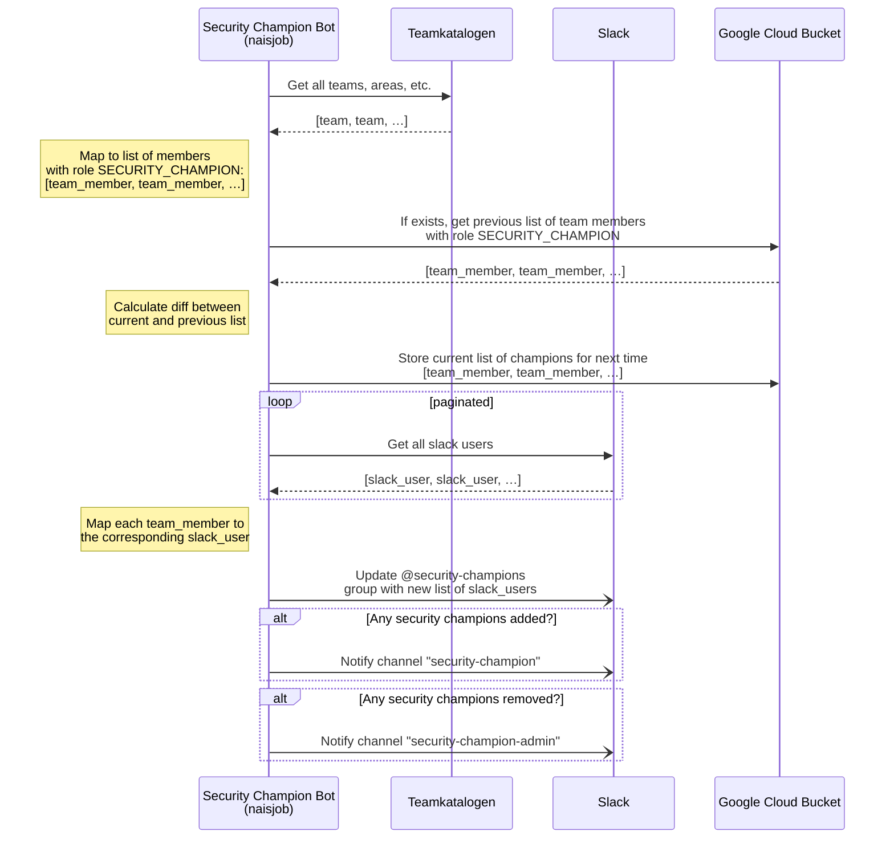

# Security Champion Slackbot

For oppfølging av Security Champions.

## Hva gjør den?

- Henter personer fra Teamkatalogen med rollen [«Security champion»](https://teamkatalog.nais.adeo.no/dashboard/members/role/SECURITY_CHAMPION) og gjør følgende:
  - Melder nye champions inn i slack-gruppen `@security-champions`
  - Ønsker nye champions velkommen i slack-kanalen `#security-champion`
  - Gir beskjed om fjernede champions i slack-kanalen `#security-champion-admin`

## Hvordan kjører den?

Slackboten er foreløpig satt opp til å kjøre som en `Naisjob` med et jevnt intervall.

- Secrets og annen konfigurasjon hentes fra Nais console
- Listen av nåværende champions lagres i en GCP Storage Bucket for senere sammenligning
- Korrelerer Teamkatalog-personer med Slack-brukere basert på enten `navIdent` eller `email`
- Slack-integrasjonen er satt opp mot en custom app [«Security Champion Bot»](https://nav-it.slack.com/apps/A02SVEV917T-security-champion-bot)

### Flyt ([mermaid](https://github.blog/2022-02-14-include-diagrams-markdown-files-mermaid/) -syntaks)

### Konfigurasjon

Mesteparten av valgene er konfigurert gjennom GCP Secret Manager, og injisert som environment-variabler ved kjøring.

| Environment-variabel                | Forklaring                                                                     | Obligatorisk | Default-verdi                          |
| ----------------------------------- | ------------------------------------------------------------------------------ | ------------ | -------------------------------------- |
| `TEAMKATALOG_API_URL`               | URL til teamkatalog-APIet                                                      | Ja           | `https://teamkatalog.nais.adeo.no/api` |
| `TEAMKATALOG_MRH_SESSION`           | MRHSession-cookie for bruk av teamkatalog-APIet utenfor FSS                    | Nei          |                                        |
| `SLACK_BOT_TOKEN`                   | Slack bot token                                                                | Ja           |                                        |
| `SLACK_SIGNING_SECRET`              | Slack signing secret                                                           | Ja           |                                        |
| `SECURITY_CHAMPION_CHANNEL`         | ID til slack-kanal for varsler                                                 | Ja           |                                        |
| `SECURITY_CHAMPION_ADMIN_CHANNEL`   | ID til slack-kanal for interne varsler                                         | Ja           |                                        |
| `SECURITY_CHAMPION_SLACK_USERGROUP` | ID til slack-brukergruppe (f.eks. @security-champions)                         | Ja           |                                        |
| `GSC_BUCKET_NAME`                   | Navn på google-bucket for ekstern cache                                        | Nei          |                                        |
| `DRY_RUN`                           | Dry-run-modus deaktiverer endringer                                            | Nei          | `false`                                |
| `FORCE_UPDATE`                      | Tvinger kjøring av oppdatering av Slack-gruppe, selv når det ikke er endringer | Nei          | `false`                                |
